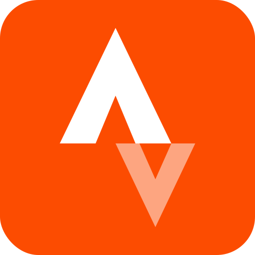

# 

# <h2 align="left">Good to meet you</h2>

- 📚 Computing Student in Glasgow, Scotland.
- 💻 Researching in variety of projects, finding the current technologies that are used in the industry to better equip myself after further education.
- 🌆Glaswegian, with a passion for software development where I can help people and me grow my career in the IT industry.

## Connect with Me

## Languages and Tools:

 
Click to learn more about what I used day to day

 
 
 

 

### Credits
[Neel Akolkar](https://github.com/ne3lakolkar)
